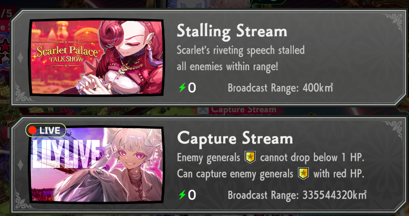

<div align="center">
    
</div>

# Kurisutaru's The Great Villainess: Strategy of Lily Mod

A mod for the *The Great Villainess: Strategy of Lily* game, developed using BepInEx 6 IL2CPP.

## Kuri Yapping Corner
1. Something wrong with the game method that repeatedly called every action, like I can enlarge the distance of the ship, but its repeatedly called and stacking into same variable not replacing, and 10 min playing, the ship effect range become entire map, so i need like collecting the array -> store it -> every subsequent call just throw those array.
   Don't trust me ? Here, Lily can capture many times earth rotation lol

   

2. Also it's friggin lag, and imbalance for last stages.

Feel free to open issue if you want to ask something or want to me looking something to implement.

## Game Information

- **Game Name**: The Great Villainess: Strategy of Lily
- **Steam Store URL**: https://store.steampowered.com/app/2454960/The_Great_Villainess_Strategy_of_Lily/
- **Tested Game Version**: build 19406299
- **.Net Version**: 6
- **BepInEx Version**: 6 Bleeding Edge

## Requirements
To compile and run this mod, you'll need:

- **BepInEx 6**: A popular modding framework for Unity games.
- **.NET 6.0**: Required for compiling BepInEx-based plugins.
- **Visual Studio** (or a compatible IDE) to build the mod (optional).

## Installation

### Installing BepInEx 6
1. Download the [BepInEx 6 Bleeding Edge IL2CPP x64](https://builds.BepInEx.dev/projects/BepInEx_be).
2. Extract the contents into the *The Great Villainess: Strategy of Lily* game directory, where the game's `KAMiBAKO.exe` is located.

### Installing and Compiling the Mod
1. Download from releases or compile yourself (see below for instructions).
2. Copy the compiled `.dll` file to the `BepInEx/plugins` folder in your *The Great Villainess: Strategy of Lily* game directory.

The folder structure should look like this:

```
KAMiBAKO/
│
├── BepInEx/
│   ├── plugins/
│   │   └── Kurisutaru-GreatVillainess-Mod.dll
│   └── config/
└── GreatVillainess.exe
```

### Verifying Installation
Launch *KAMiBAKO* and check for console output from BepInEx, confirming that the mod is loaded successfully.

## Usage

Once installed, use the mod's features as described in its documentation. Please refer to specific instructions within the mod itself.

## Configuration

A configuration file will be generated after first run with the mod installed, located in the `BepInEx/config` folder. The config file name was `net.kurisutaru.greatvillainess.cfg`.

You can edit this file to customize settings for your preferred modifications.

### Compiling Yourself
To compile yourself:

1. **Prerequisites**:
	* **Visual Studio 2022 or later**: A compatible IDE.
	* **.NET 6 SDK (or compatible version)**: For compiling the mod.
	* Copy `Assembly-CSharp.dll`, `Il2Cppmscorlib.dll`, `UnityEngine.CoreModule.dll`, and `AON.dll` from BepInEx interop folder to your project's lib folder, as these DLLs are required for compilation.

### Building the Mod
1. Clone or download the repository.
2. Open the solution file in Visual Studio.
3. Build the solution, which will output a compiled `.dll` to `bin/Debug` (or `bin/Release`) directory.
4. Copy the compiled `.dll` to the `BepInEx/plugins` folder.

## Troubleshooting
- **Mod Not Loading**: Ensure you're using IL2CPP version of BepInEx and place your mod in correct `BepInEx/plugins` folder.

## Disclaimer
All product names are trademarks of their respective companies. © Alliance Arts.

## License
This mod is released under MIT License. See [LICENSE](LICENSE.md) file for details.